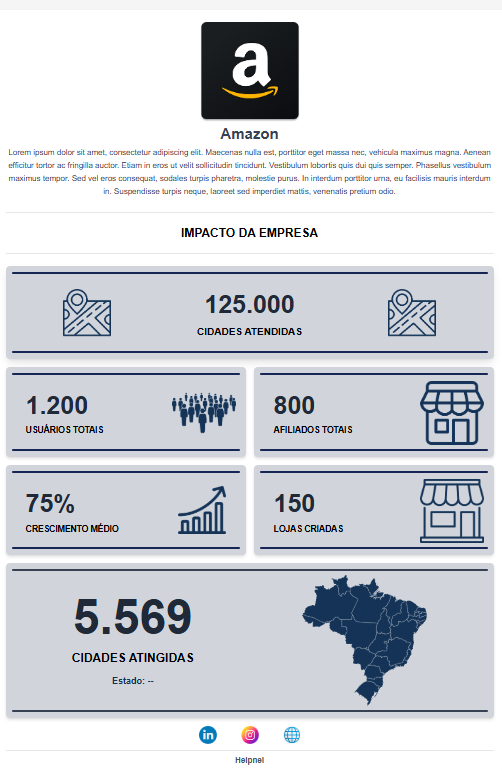
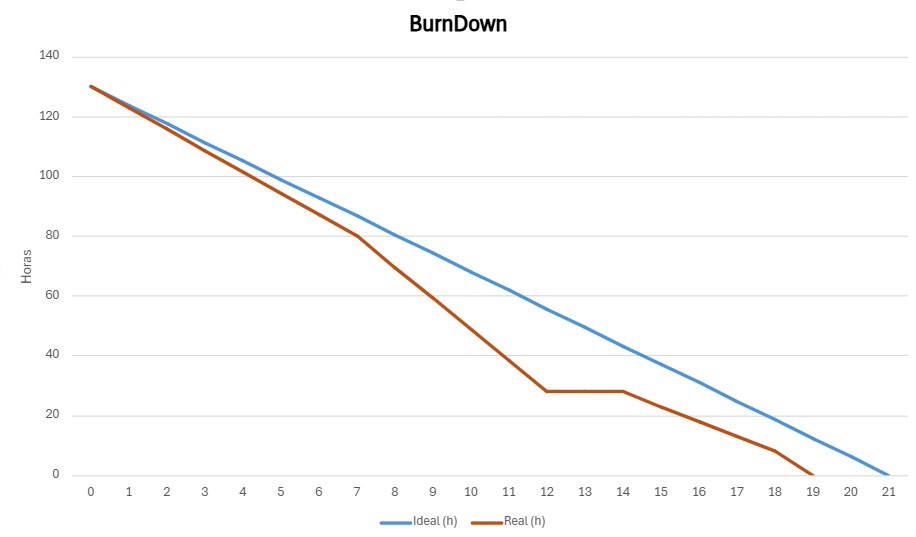

# 📌 Sprint 1 – Relatório Técnico

> **Período da Sprint:** 10/03 a 30/03/2025  
> **Status:** ✅ Concluída  
> **Equipe:** The Devs Department

---

## 🎯 Objetivo da Sprint

O projeto se baseia no desenvolvimento de um dashboard para os usuários da empresa Helpnei, especificamente para as empresas afiliadas, com foco na visualização de dados e impactos relacionados aos produtos. O objetivo é oferecer uma ferramenta que permita a essas empresas e usuários acompanharem métricas e indicadores de forma clara e acessível.

Na primeira sprint, o foco foi na criação da base estrutural do sistema, envolvendo a modelagem do banco de dados, a configuração do back-end e a construção inicial da interface. Foram realizadas tarefas como definição do layout geral, validação dos wireframes e implementação das primeiras telas com foco em responsividade. Além disso, foi criada a estrutura do banco de dados em MySQL, com seu respectivo modelo entidade-relacionamento (MER), e configurado o servidor para comunicação com o banco e a API.

Com isso, foi possível entregar uma primeira versão funcional, contendo o fluxo básico de estruturação da aplicação, integração entre as camadas e layout inicial do dashboard. Essa base garante suporte para a implementação futura das funcionalidades de visualização de impacto, conforme esperado pelas empresas afiliadas.

---

## ✅ Tarefas Concluídas

| Tarefa                                                                 |
|------------------------------------------------------------------------|
| Definir Layout Geral                                                  |
| Ajuste de Design conforme o FeedBack                                  |
| Validação do wireframe                                                |
| Criação da estrutura básica da(s) tela(s)                             |
| Implementação do Layout Responsivo para diferentes dispositivos       |
| Estilização das telas com base no Design Validado                     |
| Desenvolver os dashboards com base no wireframe                       |
| Criar seções para gráficos e métricas                                 |
| Modelar o Banco de Dados com base nos requisitos                      |
| Criação do modelo entidade relacionamento (MER)                       |
| Implementar no MySQL                                                  |
| Configurar um servidor básico no backend (Node.js, Django etc)        |
| Teste de Requisição                                                   |
| Estabelecer conexão com o banco de dados                              |

---

## 📌 Requisitos Atendidos

| Código   | Requisito                                                                                  | Status       |
|----------|---------------------------------------------------------------------------------------------|--------------|
| RF-01    | Desenvolver um Dashboard de Indicadores                                                    | ✅ Feito      |
| RF-02    | Exibir o número de lojas criadas                                                           | 🟡 Parcial    |
| RF-03    | Mostrar a quantidade de usuários impactados                                                | 🟡 Parcial    |
| RF-04    | Exibir a distribuição geográfica das lojas e usuários                                      | 🟡 Parcial    |
| RNF-01   | Criar um Manual do Usuário                                                                  | ❌ Não feito nesta sprint |
| RNF-02   | Definir uma Modelagem de Banco de Dados                                                    | ✅ Feito      | |

---

## 🎨 Design da Sprint

---

## 📊 Burndown Chart

> 📈 **Observação:** O burndown ficou abaixo da linha ideal nesta sprint, pois houve uma contribuição significativa de toda a equipe logo na primeira semana. Embora os finais de semana não estivessem no planejamento original, alguns desenvolvedores optaram por trabalhar nesses dias, o que adiantou consideravelmente a entrega.

---

## 📎 Documentos da Sprint

- [📄 Definition of Ready (DoR) – Sprint 1](./docs/sprints/sprint1/DoR-sprint1.pdf)  
- [📄 Definition of Done (DoD) – Sprint 1](./docs/sprints/sprint1/Definition%20of%20Done(DoD)-sprint1.pdf)  
- [📄 Product Backlog – Sprint 1](./docs/sprints/sprint1/ProductBacklog-sprint1.pdf)

