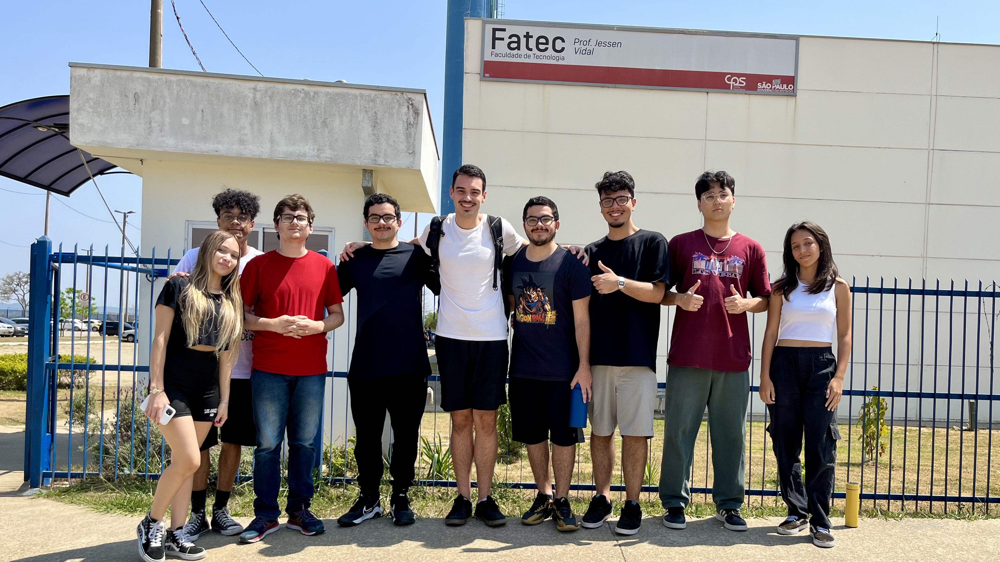

  <a href="#visao-do-projeto">Visão do Projeto</a> •
  <a href="#cronograma">Cronograma</a> •
  <a href="#product-backlog">Product Backlog</a> •
  <a href="#sprint-backlog">Sprint Backlog</a> •
  <a href="#documentos">Documentos</a> •
  <a href="#tecnologias">Tecnologias</a> •
  <a href="#equipe">Equipe</a>

---

## 📌 Visão do Projeto 
O **Dashboard Helpnei** é uma solução web desenvolvida pela The Devs Department em parceria com a empresa **Helpnei**, no âmbito do 2º Semestre de DSM da Fatec São José dos Campos. O objetivo é oferecer um painel de indicadores que permita:

- Monitorar métricas de **lojas**, **usuários** e **transações**.
- Gerar relatórios e gráficos interativos para apoiar decisões estratégicas.
- Filtrar dados por período, região e categoria de usuário.
- Acessar insights em tempo real para patrocinadores e administradores.

> **Metodologia:** Ágil SCRUM (3 sprints + Feira de Soluções)  
> **Foco:** Proatividade, autonomia, colaboração e entrega de resultados.

---

## 🗓️ Cronograma 
| Entrega              | Período               | Status         | Relatório                 |
|----------------------|-----------------------|----------------|---------------------------|
| **Kick Off**         | 24/02 – 28/02/2025    | ✅ Concluído   |       |
| **Sprint 1**         | 10/03 – 30/03/2025    | ✅ Concluído   | [ver relatório](docs/sprints/sprint1/sprint1.md)     |
| **Sprint 2**         | 07/04 – 27/04/2025    | ⏳ Em andamento | [ver relatório](docs/sprints/sprint2/sprint2.md)      |
| **Sprint 3**         | 05/05 – 25/05/2025    | ⌛ Planejado   | [ver relatório](docs/sprints/sprint3/sprint3.md)      |
| **Feira de Soluções**| 29/05/2025            | ⌛ Planejado   |      |

---

## 📊 Product Backlog 
| Ranking | Prioridade | User Story                                                                                                        | Estimativa | Sprint    | Código   |
|:-------:|:----------:|:-------------------------------------------------------------------------------------------------------------------|:----------:|:---------:|:--------:|
| 1       | Alta       | Como Administrador, quero acessar um painel com indicadores principais.                                            | 40         | Sprint 1  | RF-01    |
| 2       | Alta       | Como Administrador, quero um banco de dados estruturado para usuários e lojas.                                     | 60         | Sprint 1  | RNF-02   |
| 3       | Média      | Como Patrocinador, quero ver o número total de lojas criadas.                                                      | 40         | Sprint 2  | RF-02    |
| 4       | Média      | Como Patrocinador, quero ver o número de usuários impactados.                                                     | 40         | Sprint 2  | RF-03    |
| 5       | Média      | Como Usuário, quero escolher entre empresas patrocinadoras.                                                       | 40         | Sprint 2  | RF-04    |
| 6       | Alta       | Como Usuário, quero preencher formulário de inscrição com meus dados.                                             | 35         | Sprint 2  | RF-05    |
| 7       | Alta       | Como Usuário, quero visualizar lista de patrocinadores disponíveis.                                               | 30         | Sprint 2  | RF-06    |
| 8       | Alta       | Como Patrocinador, quero definir critérios de seleção de usuários.                                                | 45         | Sprint 2  | RF-07    |
| 9       | Baixa      | Como Patrocinador, quero aplicar filtros (estado, idade, renda) para encontrar usuários.                           | 45         | Sprint 3  | RF-08    |
| 10      | Alta       | Como Administrador, quero filtrar indicadores do dashboard por categoria.                                         | 45         | Sprint 3  | RF-09    |
| 11      | Média      | Como Usuário, quero acessar manual de uso do sistema.                                                             | 40         | Sprint 3  | RNF-01   |
| 12      | Alta       | Como Administrador, quero ver distribuição geográfica de lojas e usuários.                                         | 40         | Sprint 3  | RF-10    |
| 13      | Alta       | Como Administrador, quero acompanhar engajamento e tendências de uso.                                              | 45         | Sprint 3  | RF-11    |
| 14      | Baixa      | Como Patrocinador, quero interface intuitiva com cores nos cards para facilitar leitura.                          | 45         | Sprint 3  | RF-12    |

---

## 📂 Sprint Backlog 
### [Visualizar Sprint Backlog](docs/sprint_backlog.pdf)

------

## 📄 Documentos 
- 📃 **Definição de Pronto (DoD)** – atualizado com entregas feitas até o momento: [`docs/dod_geral.pdf`](docs/dod_geral.pdf)
- 📌 **Definição de Pronto para iniciar (DoR)** – critérios gerais de início de tarefa: [`docs/dor_geral.pdf`](docs/dor_geral.pdf)
- 🗂️ **Sprint Backlogs** – com tarefas das Sprints 1, 2 e 3: [`docs/sprint_backlogs.pdf`](docs/entregas/Product_Backlog-atual.pdf)
- 📁 **Documentação Geral** – visão técnica e funcional do projeto: [`docs/documentacao_geral.pdf`](docs/documentacao_geral.pdf)
- 📘 **Manual do Usuário** – instruções para uso do sistema: [`docs/manual_usuario.pdf`](docs/manual_usuario.pdf)

## 🎨 Protótipo & Mockups 
Visão inicial da interface do **Dashboard Helpnei**, desenvolvida para validar a experiência do usuário antes da implementação.

  

### ✨ Principais Funcionalidades
- **Painel de métricas** (lojas, usuários, transações)
- **Filtros** por período, região e categoria
- **Visualização gráfica** em cards interativos
- **Design responsivo** para diferentes dispositivos

## 🛠️ Tecnologias Utilizadas 

  

    
    
    
    
    
    
    
    
    
    
  

---

## 👥 Equipe 

  

 

| Função           | Nome                  | LinkedIn • GitHub                                                                             |
|------------------|-----------------------|-----------------------------------------------------------------------------------------------|
| Product Owner    | Gustavo Almeida       | [LinkedIn](https://www.linkedin.com/in/gustavo-almeida-camargo/) • [GitHub](https://github.com/GustavoAC0802) |
| Scrum Master     | Tatiane Oliveira      | [LinkedIn](https://www.linkedin.com/in/tatiane-oliveira-a66789296/) • [GitHub](https://github.com/TatianeOliveira8) |
| Dev Team         | Pedro Alves           | [LinkedIn](https://www.linkedin.com/in/pedro-alves-579a93140/) • [GitHub](https://github.com/pphvaz) |
| Dev Team         | Nicoly Guedes         | [LinkedIn](https://www.linkedin.com/in/nicoly-guedes-dev/) • [GitHub](https://github.com/nicolygz) |
| Dev Team         | Guilherme Almeida     | [LinkedIn](https://www.linkedin.com/in/guilherme-almeida-profile/) • [GitHub](https://github.com/AlmdGuilherme) |
| Dev Team         | Pedro Martins         | [LinkedIn](https://www.linkedin.com/in/pedro-henrique-martins-55a0752a4/) • [GitHub](https://github.com/pedro-h-martins) |
| Dev Team         | Otávio Vianna         | [LinkedIn](https://www.linkedin.com/in/ot%C3%A1vio-vianna-lima-1b26a932a/) • [GitHub](https://github.com/tuzzooz) |
| Dev Team         | Issami Umeoka         | [LinkedIn](https://www.linkedin.com/in/issami-umeoka-786716226/) • [GitHub](https://github.com/IssamiU) |
| Dev Team         | Tiago Freitas         | [LinkedIn](https://www.linkedin.com/in/tiago-freitas-74730b2a9/) • [GitHub](https://github.com/tiagow2) |

---

[Visualizar Vídeo de Demonstração](https://www.youtube.com/watch?v=KzmAM3UuZv8)

→ [Voltar ao topo](#topo)

